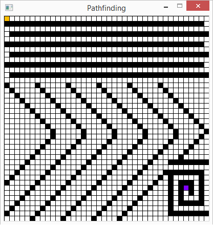

# Pathfinding
## Table of contents
* [Goal of the project](#goal-of-the-project)
* [Technologies](#technologies)
* [Launching the application](#launching-the-application)
## Goal of the project:
Implementation of A * and Breadth First Search algorithms, finding the shortest path.
Below there is a screenshot showing the operation of the application.<br>
 <br><br>

## Technologies:
* Go 1.15.8<br>
* SDL 2.0.14<br>
## Launching the application:
To run this application, install GO and SDL2, go to the folder with the app.go file and type in the terminal:<br>
```
$ go run app.go
```
Add the start and start vertices and the obstacles with the right mouse button<br>
(you can undo the change with the left mouse button).<br>
Press the a key if you want to use the A * algorithm or the b key for BFS.<br>
The c key clears the board so that you can use the app from again.
